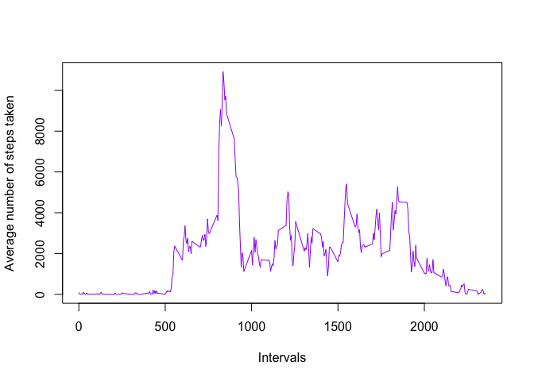

## Loading and preprocessing the data

```r
if( !file.exists("activity.csv")){
unzip("activity.zip")
}
unzip("activity.zip")
data<-read.csv("activity.csv", header=TRUE)
names(data)
```

```
## [1] "steps"    "date"     "interval"
```

```r
head(data)
```

```
##   steps       date interval
## 1    NA 2012-10-01        0
## 2    NA 2012-10-01        5
## 3    NA 2012-10-01       10
## 4    NA 2012-10-01       15
## 5    NA 2012-10-01       20
## 6    NA 2012-10-01       25
```

```r
datana<- na.omit(data)
```
## What is mean total number of steps taken per day?

1. Calculate the total number of steps taken per day


```r
daily_steps<- aggregate( datana$steps, by= list(Steps.Date=datana$date), FUN="sum")
```

2. Histogram of the total number of steps taken each day

```r
hist(daily_steps$x, col="pink",
     breaks=20,
     main= "Total number of steps taken per day",
     xlab="Number of steps per day")
```

<!-- -->

3. Mean and median number of steps taken each day

```r
mean_steps <- mean (daily_steps [,2])
print(mean_steps)
```

```
## [1] 10766.19
```

```r
median_steps <-median (daily_steps [,2])
print(median_steps)
```

```
## [1] 10765
```

## What is the average daily activity pattern?
1. Time series plot of the average number of steps taken

```r
average<-aggregate(datana$steps, by= list(steps.interval=datana$interval), FUN="sum")
plot(average$steps.interval, average$x, type="l", col="purple", xlab="Intervals", ylab="Average number of steps taken")
```

<!-- -->

2. Which 5-minute interval, on average across all the days in the dataset, contains the maximum number of steps?


```r
interval_max_steps <- average[which.max(average$x),]$steps.interval
interval_max_steps
```

```
## [1] 835
```

## Imputing missing values
1. Calculate and report the total number of missing values in the dataset

```r
totalNA<-sum(is.na(data$steps))
totalNA
```

```
## [1] 2304
```
2. Devise a strategy for filling in all of the missing values in the dataset. 
(use the mean/median for that day, or the mean for that 5-minute interval)

```r
meandata<-mean(datana$steps)
```
3. Create a new dataset that is equal to the original dataset but with the missing data filled in.


```r
data_in <- data
sum(is.na(data_in))
```

```
## [1] 2304
```


```r
data_in$steps[is.na(data_in$steps)] <- meandata
colSums(is.na(data_in))
```

```
##    steps     date interval 
##        0        0        0
```

Let's probe it works:

```r
sum(is.na(data_in))
```

```
## [1] 0
```

4. Make a histogram of the total number of steps taken each day and Calculate and report the mean and median total number of steps taken per day. Do these values differ from the estimates from the first part of the assignment? What is the impact of imputing missing data on the estimates of the total daily number of steps?


```r
daily_stepsna<- aggregate( data_in$steps, by= list(Steps.Da=data_in$date), FUN="sum")
hist(daily_stepsna$x, col="pink",
     breaks=20,
     main= "Total number of steps taken per day",
     xlab="Number of steps per day"
     )
```

<!-- -->

### Comparative Histogram

<!-- -->

4.1 . Mean and median number of steps taken each day of the filled data

```r
mean_steps1 <- mean (daily_stepsna [,2])
print(mean_steps1)
```

```
## [1] 10766.19
```

```r
median_steps1 <-median (daily_stepsna [,2])
print(median_steps1)
```

```
## [1] 10766.19
```

## Are there differences in activity patterns between weekdays and weekends?

1. Create a new factor variable in the dataset with two levels – “weekday” and “weekend” indicating whether a given date is a weekday or weekend day.


```r
data_in$date<-as.Date(data_in$date)
data_in$weekday<- weekdays(data_in$date)
data_in$day_type<-ifelse(data_in$weekday=="Saturday" |  data_in$weekday=="Sunday", "Weekend", "Weekday")
data_in$day_type <- factor(data_in$day_type)
```

2. Make a panel plot containing a time series plot (i.e. \color{red}{\verb|type = "l"|}type = "l") of the 5-minute interval (x-axis) and the average number of steps taken, averaged across all weekday days or weekend days (y-axis). 


```r
average_days <- aggregate(steps ~ interval + day_type, data=data_in, mean)

library(ggplot2)

ggplot(average_days, aes(interval, steps)) + 
    geom_line( colour="purple") + 
    facet_grid(day_type ~ .) +
    xlab("5-minute interval") + 
    ylab("Average number of steps")
```

<!-- -->

